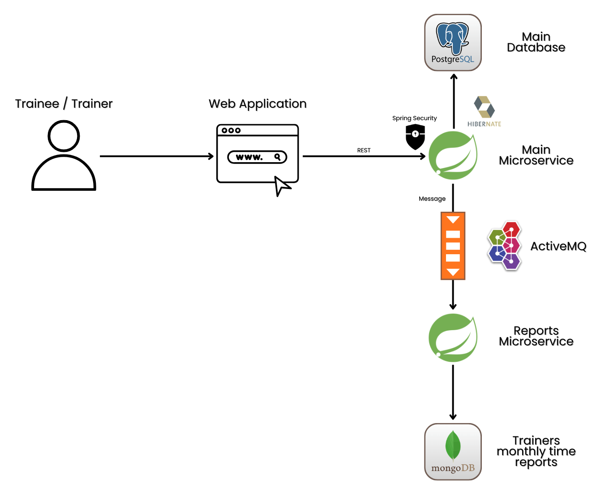

# Gym CRM Distributed System
## System Architecture Overview

Gym CRM is a distributed, multi-module Java ecosystem orchestrated using Docker Compose. The architecture employs a shared bridge network to enable seamless communication between two business-centric microservices while preserving strict separation of concerns through asynchronous event propagation.



## Module Specifications & Technology Stack

### 1. Main Service
The operational backbone of the platform, this RESTful API manages the full training lifecycle, including trainers, trainees, workout sessions, training categories, and user authentication.

- **Framework:** Spring Boot, Spring Security (JWT)
- **Primary Persistence:** PostgreSQL (ACID-compliant transactions)
- **Performance Layer:** Redis (token blacklist and brute force lockouts)
- **Messaging:** ActiveMQ (publishes domain events)
- **Testing:** JUnit5 (TDD), Cucumber (BDD)
- **Port:** 8080

### 2. Reports Service
A specialized microservice designed to complement the Gym CRM solution, focusing on managing trainers’ workloads.

- **Framework:** Spring Boot
- **Persistence Strategy:** MongoDB
- **Messaging:** ActiveMQ (listens for workload updates)
- **Testing:** JUnit5 (TDD), Cucumber (BDD)
- **Port:** 8081

### 3. Integration Tests
This module ensures that the distributed components work cohesively as a unified system.

- **Tools:** Testcontainers (ephemeral infrastructure), Rest Assured (API validation)
- **Scope:** Validates inter-service communication, message delivery, and database state consistency
- **Testing:** JUnit5 (TDD), Cucumber (BDD)

## Infrastructure & Orchestration

- **Deployment:** Docker Compose defines the environment, ensuring consistency between local development and production
- **Networking:** Isolated Docker bridge network for secure internal service-to-service discovery
- **Environment:** Fully configuration-driven via environment variables for portability

## Deployment Options

### 1. Standalone Deployment

This deployment mode allows each microservice to run independently. Inter-service communication via a message broker is disabled, and embedded databases are used for data persistence. Ideal for local development or testing without dependencies.

**1. Build Docker images**

```bash
docker build -f ./main-service/Dockerfile -t standalone-main-service .
docker build -f ./reports-service/Dockerfile -t standalone-reports-service .
```

**2. Set a common JWT secret**

```bash
$env:JWT_SECRET_KEY="JWT_SECRET_KEY"
```

**3. Run the containers**

```bash
docker run -d -e JWT_SECRET_KEY=$env:JWT_SECRET_KEY -p 8080:8080 standalone-main-service
docker run -d -e JWT_SECRET_KEY=$env:JWT_SECRET_KEY -p 8081:8081 standalone-reports-service
```

---

### 2. Production Deployment

This deployment mode enables full cooperation between microservices. Services communicate via a message broker, resilience mechanisms are configured to handle connection failures, and embedded databases are replaced with persistent storage volumes.

**1. Launch services with Docker Compose**

```bash
docker-compose up -d
```

**2. Verify running containers**

```bash
docker ps
```

**3. Access services**

* **Main Microservice:** [http://localhost:8080/swagger-ui/index.html](http://localhost:8080/swagger-ui/index.html)
* **Reports Microservice:** [http://localhost:8081/swagger-ui/index.html](http://localhost:8081/swagger-ui/index.html)

### Note
Here is a short demonstration video showcasing the deployment process and highlighting some key functionalities:
[Project-Demonstration](Project-Demonstration.mp4)
